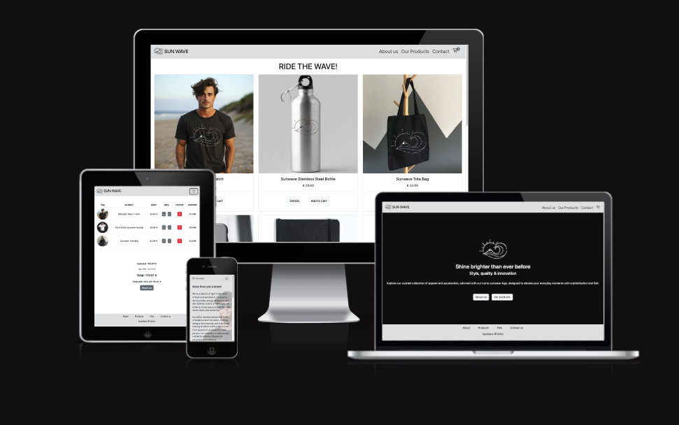

# 🌊 Sun Wave
A fictional print-on-demand webshop, created as a portfolio project to showcase modern web development, UI/UX design, and e-commerce features using Angular.

## Concept
Inspired by the boundless energy of the sun and the rhythmic motion of the waves, Sun Wave blends elegance and innovation into every design.
All high-end items proudly feature the iconic Sun Wave logo — a symbol of strength, warmth, and endless possibilities.

Sun Wave isn’t just a brand — it’s a lifestyle.

## Live Site: https://iliana.codefactory.live/sun_wave/

## 🛍️ Features

    🛒 Shopping Cart – Add, remove, and manage items
    🌐 Responsive Design – Mobile-first and fully adaptable layout
    🎨 Modern UI – Clean, minimalist, and stylish interface
    🧭 Smooth Navigation – Fast and intuitive browsing experience
    🛍️ Webshop Simulation – Explore products and view details

## ⚙️ Technologies Used

    Angular
    TypeScript
    Bootstrap
    HTML & CSS

## 🛠️ Project Setup
### Install dependencies
    npm install
### Start local dev server
    ng serve
### Build for deployment
    ng build --base-href /sun_wave/

## 📄 Notes
This is a fictional webshop built for portfolio/demo purposes only.
Products, branding, and any likenesses are conceptual.